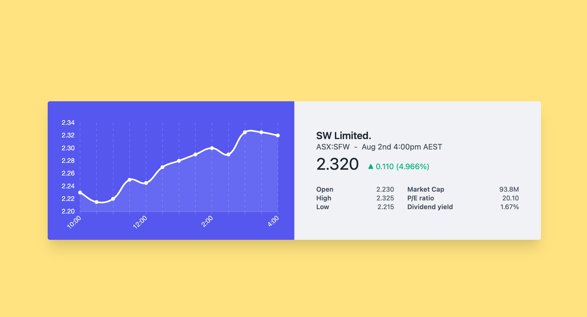

# Intro

This project forked from https://codepen.io/ScottWindon/pen/RwrXLJR

use [React](https://reactjs.org/) , [Tailwind css](https://tailwindcss.com) and [Chart js](https://www.chartjs.org/) build stock card demo project.

install tips:
* create react start project see [there](https://github.com/facebook/create-react-app)
* add tailwind support see [there](https://tailwindcss.com/docs/guides/create-react-app)
* tailwind need craco see [there](https://tailwindcss.com/docs/guides/create-react-app#install-and-configure-craco)

# Show

